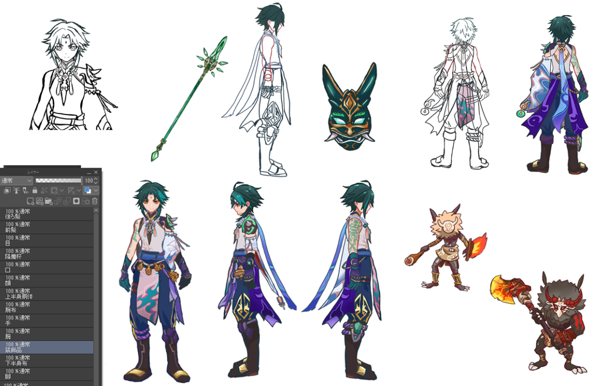

# xiao_love

「誰かの心を揺さぶる一瞬」を作りたくて、  
私は魈くんを、この手で動かすことを決めました。

---

## ✨ 概要

かつて落選したエンタメ系制作会社のブログを読んで、悔しくて泣きました。

どうしても、どうしても、エンタメに命をかけたくて。

その想いだけで、一人で描き、設計し、出力し、コーディングし、動かすことにしました。

私が本当に作りたいのは、ただのページじゃない。  
「誰かの心を揺さぶる一瞬」なんです。

---

## 🧧 制作背景と挑戦

最推しである魈くんを動かすため、  
作業工程は**ほぼすべて初挑戦**でしたが、何度も躓いて心が折れそうになりながらも手を止めずに進みました。

最初はいくらプロンプトを打っても理想の魈くんが現れず、  
**「なら描くしかない」**と決め、  
**10年ぶりに古のペンタブ（2008年製Bamboo）を握りました。**

---

## 🖼️ Preview

このプロジェクトで実際に描いた魈くんパーツの一部です。
すべて手描き・パーツ分け・構造設計済み。  
最推しへの愛と技術が込められています。

---

## 🔧 技術構成

- 全方向イラストを**すべて手描きで自作**（front, back, left_side, right_side）
- **パーツは個別PNG化**、768px基準で `fullsize` / `resized` に分割
- **Google Drive × Colab UI × ControlNet** を連携
- LoRAモデル（`.safetensors`）を自前で取得・構成
- **フォルダ階層設計・命名ルール・自動変換コマンド**も導入済み
- 他者でも再現できるよう、**ColabノートブックのUIフォーム設計も実施**

🕒 制作期間：2日  
🖼️ 作成枚数：116枚（すべて手作業・色分け済・パーツ分解済）

---

## 📁 ディレクトリ構成（抜粋）

xiao_assets/ ├── front/ │ ├── fullsize/ │ │ ├── arm.png │ │ ├── face.png │ │ └── ... │ └── resized/ │ ├── arm_768.png │ ├── face_768.png │ └── ... ├── back/ ├── left_side/ ├── right_side/ └── extras/ ├── mask.png └── weapon_wahaku_en.png

---

## ⚠️ 注意事項

🔒 このリポジトリ内の素材はすべて非営利の**ファンアート作品**です。  
原神／魈に関する一切の著作権はHoYoverse様に帰属いたします。
本データの再配布・二次利用・AI学習利用・商用利用は禁止です。

🔒 This is a non-commercial, fan-art based project.  
All rights to Genshin Impact and the character Xiao belong to HoYoverse.  
Please do not use, redistribute, or repurpose these files.
