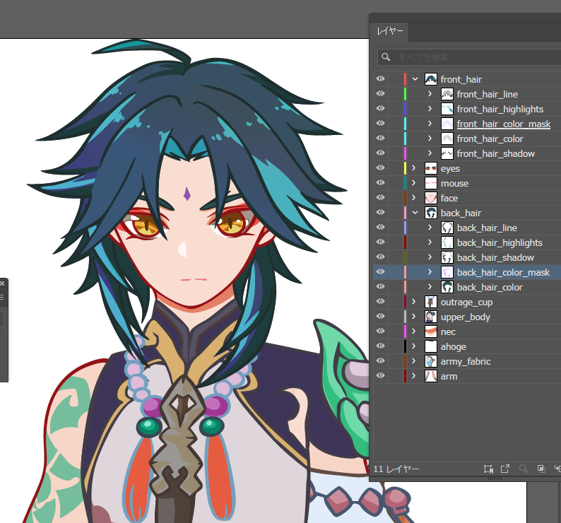

# xiao_love

「誰かの心を揺さぶる一瞬」を作りたくて、  
私は魈くんを、この手で動かすことを決めました。

---

## ✨ 概要

かつて落選したエンタメ系制作会社のブログを読んで、悔しくて泣きました。

どうしても、どうしても、エンタメに命をかけたくて。

その想いだけで、一人で描き、設計し、出力し、コーディングし、動かすことにしました。

私が本当に作りたいのは、ただのページじゃない。  
「誰かの心を揺さぶる一瞬」なんです。

---

## 🧧 制作背景と挑戦

最推しである魈くんを動かすため、  
作業工程は**ほぼすべて初挑戦**でしたが、何度も躓いて心が折れそうになりながらも手を止めずに進みました。

最初はいくらプロンプトを打っても理想の魈くんが現れず、  
**「なら描くしかない」**と決め、  
**10年ぶりに古のペンタブ（2008年製Bamboo）を握りました。**

---

## 🖼️ Preview

このプロジェクトで実際に描いた魈くんパーツの一部です。
すべて手描き・パーツ分け・構造設計済み。  
最推しへの愛と技術が込められています。

---

## 🧪 プロジェクト構成と技術的な変遷記録

本リポジトリは当初、Colab＋LoRA（Stable Diffusion）の組み合わせで構築を進めていましたが、  
**以下のような数々の試練と葛藤を経て、現在は「完全手描きによるSVG構成」へと移行しています。**

---

## ❌ 旧構成：AIベースの生成パイプライン（現在は不採用）

- Colab環境でLoRAを用いた魈くん生成（camenduru系notebook）
- 画像出力後、PNGをパーツ分割 → CSSアニメ or Lottieなどで動かす構成
- 主な問題点：
  - Colabで**不可視エラー（通称：ステルスエラー）**に悩まされる
  - `grep` でノートブックのあらゆるログを解析する羽目に
  - Leonardo.aiでも思うような出力にならず、「謎の物体」と化す
  - LoRA強度調整などによる**“鍛造職人フェーズ”**に突入

---

## ✅ 現在の構成：完全手描きベクター＋SVGモジュール設計（現役）

- Clip Studioでパーツごとに清書 → Illustratorで整形 → SVG化（2025/04/20時点ではバストアップの正面のみ作成）
- 塗り・光・影すべて分離してパス構成化
- グラデーションは描画モードを活かしつつ**マスク＆レイヤー構造で再現**
- 全パーツ命名済み（例：`front_hair_color`, `eye_highlight`, `ahoge` など）
- SVGはGSAP・Lottie・Canvas制御に備えた**アニメーション前提設計**

---

## 📝 現在未使用の構成記録（備忘録）

`/assets/png/` 以下に存在するPNG書き出し素材は、旧構成で使用予定だったパーツ分割画像です。  
現在は**完全に未使用**となっており、記録としてのみ残しています。

### 🔧 技術構成（備忘録）

- 全方向イラストを**すべて手描きで自作**（front, back, left_side, right_side）
- **パーツは個別PNG化**、768px基準で `fullsize` / `resized` に分割
- **Google Drive × Colab UI × ControlNet** を連携
- LoRAモデル（`.safetensors`）を自前で取得・構成
- **フォルダ階層設計・命名ルール・自動変換コマンド**も導入済み
- 他者でも再現できるよう、**ColabノートブックのUIフォーム設計も実施**

🕒 制作期間：2日  
🖼️ 作成枚数：116枚（すべて手作業・色分け済・パーツ分解済）

### 📁 ディレクトリ構成（備忘録）（備忘録）

xiao_assets/ ├── front/ │ ├── fullsize/ │ │ ├── arm.png │ │ ├── face.png │ │ └── ... │ └── resized/ │ ├── arm_768.png │ ├── face_768.png │ └── ... ├── back/ ├── left_side/ ├── right_side/ └── extras/ ├── mask.png └── weapon_wahaku_en.png

---

## 🎨 この構成に込めた思い

**「AIで生まれなかった理想の魈は、私の手で創るしかなかった。」**  
その一心で、清書 → パーツ分け → グラデ設計 → 構造命名まですべて手作業で行いました。

SVG構成の髪のパスの吸着不良やエイリアス隙間に悩まされ、  
再塗り・再書き出し・再マスクの繰り返し――そのすべてがこのリポジトリに込められています。

---

## 🎉 Xiao's Birthday Special 🎂

In celebration of Xiao's birthday (April 17th, 2025),  
this project includes a special Svelte-based birthday animation 🎈✨

✨ Happy 2000+ years, Guardian Yaksha ✨  
May you always be blessed with peace... and *infinite almond tofu*. 🍮🍮🍮🍮🍮

Svelteの練習で魈くんをお祝いし、杏仁豆腐バーストをしました。

---

## ⚠️ 注意事項

🔒 このリポジトリ内の素材はすべて非営利の**ファンアート作品**です。  
原神／魈に関する一切の著作権はHoYoverse様に帰属いたします。
本データの再配布・二次利用・AI学習利用・商用利用は禁止です。

🔒 This is a non-commercial, fan-art based project.  
All rights to Genshin Impact and the character Xiao belong to HoYoverse.  
Please do not use, redistribute, or repurpose these files.
